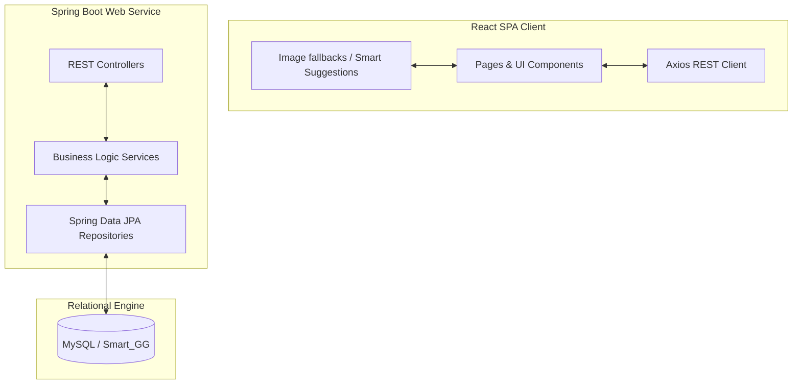
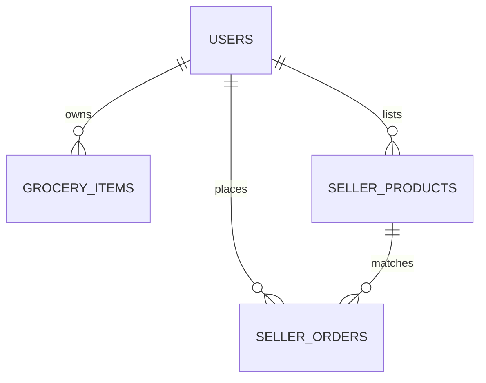

# 🍏 Smart Grocery - Complete Project Architecture Guide

Welcome to the **Smart Grocery** project! This guide is designed to help you learn, explore, and master the codebase. It details the stack, architecture, data flow, database schemas, frontend components, and the custom algorithms powering the app.

---

## 🏗️ 1. System Architecture Overview

The application is structured as a **Decoupled Client-Server Architecture** communicating over a RESTful API:



### Flow of Request:
1. **User Action**: A user interacts with the React frontend (e.g. adding an item to their inventory on the `InventoryPage`).
2. **API Call**: The frontend uses `Axios` to send an authenticated HTTP request (containing a JWT/session context) to the Spring Boot server.
3. **Routing**: The corresponding `@RestController` receives the request, validates DTO inputs, and extracts authentication details (`Principal`).
4. **Business Logic**: The controller delegates to a `@Service` bean, which processes stock states, alert dates, or order queues.
5. **Data Layer**: The service reads/writes from the database using a `JpaRepository` interface.
6. **Response**: Data is mapped back into JSON and returned to the client, which updates the local React state and updates the view.

---

## 🗄️ 2. Database Schema & Models

The database contains tables representing the core domain concepts of the grocery management platform:



### Table Structure & Columns

#### 1. USERS (`users`)
Managed in [User.java](file:///c:/Smart_Grocery/backend/src/main/java/com/example/backend/entity/User.java)
Stores credentials, roles, and authentication providers.
*   `id` (BIGINT, Primary Key): Unique user ID.
*   `username` (VARCHAR, Unique): Username used for login.
*   `email` (VARCHAR, Unique): Contact email.
*   `password` (VARCHAR): Encrypted password hash (Bcrypt).
*   `role` (VARCHAR / Enum): User permissions role (`USER`, `SELLER`, `ADMIN`, `SUPERADMIN`).
*   `provider` (VARCHAR): Login provider (`LOCAL` or `GOOGLE`).

#### 2. GROCERY ITEMS (`grocery_items`)
Managed in [GroceryItem.java](file:///c:/Smart_Grocery/backend/src/main/java/com/example/backend/entity/GroceryItem.java)
Stores the items in a user's local kitchen inventory.
*   `id` (BIGINT, Primary Key): Item ID.
*   `name` (VARCHAR): E.g., "Amul Fresh Milk", "Whole Wheat Bread".
*   `category` (VARCHAR): Category matching tags (e.g. `dairy`, `bakery`, `vegetables`).
*   `quantity` (INT): Number of units currently stocked.
*   `purchased` (BOOLEAN): Status of the item (`true` = Bought/In-Stock, `false` = Needed/Pending).
*   `expiry_date` (DATE): When the item will spoil.
*   `last_purchased_at` (TIMESTAMP): Date when the user marked the item as purchased.
*   `user_id` (BIGINT, Foreign Key): Links the item to a specific [User](file:///c:/Smart_Grocery/backend/src/main/java/com/example/backend/entity/User.java).
*   `image_url` (VARCHAR): Custom graphic URL uploaded by the user.

#### 3. SELLER PRODUCTS (`seller_products`)
Managed in [SellerProduct.java](file:///c:/Smart_Grocery/backend/src/main/java/com/example/backend/entity/SellerProduct.java)
Stores products listed by local grocery sellers for purchase.
*   `id` (BIGINT, Primary Key): Product ID.
*   `name` (VARCHAR): Product name.
*   `category` (VARCHAR): Product category.
*   `price` (DOUBLE): Product unit cost in local currency (INR).
*   `stock` (INT): Quantities available to sell.
*   `expiry_date` (DATE): Anticipated expiry of batch.
*   `active` (BOOLEAN): Listing visibility.
*   `seller_id` (BIGINT, Foreign Key): Links to the [User](file:///c:/Smart_Grocery/backend/src/main/java/com/example/backend/entity/User.java) listing the product.
*   `image_url` (VARCHAR): Image uploaded by the seller.

#### 4. SELLER ORDERS (`seller_orders`)
Managed in [SellerOrder.java](file:///c:/Smart_Grocery/backend/src/main/java/com/example/backend/entity/SellerOrder.java)
Tracks consumer purchases made from sellers.
*   `id` (BIGINT, Primary Key): Order ID.
*   `quantity` (INT): Quantity purchased.
*   `status` (VARCHAR / Enum): Order status (`PENDING`, `APPROVED`, `DELIVERED`, `CANCELLED`).
*   `payment_method` (VARCHAR): E.g. `GPAY`, `CARD`, `CASH`.
*   `upi_id` (VARCHAR): Payment handle for online verification.
*   `payment_verified` (BOOLEAN): Payment authorization flag.
*   `product_id` (BIGINT, Foreign Key): Links to [SellerProduct](file:///c:/Smart_Grocery/backend/src/main/java/com/example/backend/entity/SellerProduct.java).
*   `user_id` (BIGINT, Foreign Key): Consumer [User](file:///c:/Smart_Grocery/backend/src/main/java/com/example/backend/entity/User.java) placing the order.

---

## ⚙️ 3. Backend Implementation (Spring Boot)

The backend is built with Spring Boot, leveraging **Spring Security** for secure authorization and **Hibernate** for object-relational database mapping.

### Layered Architecture

#### 1. Controller Layer
Provides RESTful APIs. Endpoints extract the authenticated context using Spring Security's `Principal` object.
*   [AuthController.java](file:///c:/Smart_Grocery/backend/src/main/java/com/example/backend/controller/AuthController.java): Handles signup, JWT login, and session validation.
*   [GroceryController.java](file:///c:/Smart_Grocery/backend/src/main/java/com/example/backend/controller/GroceryController.java): Exposes endpoints for consumer inventory CRUD operations, recommendations, and alert acknowledgement.
*   [SellerController.java](file:///c:/Smart_Grocery/backend/src/main/java/com/example/backend/controller/SellerController.java): Exposes endpoints for sellers to publish products and fulfill incoming order queues.
*   [AdminController.java](file:///c:/Smart_Grocery/backend/src/main/java/com/example/backend/controller/AdminController.java): Exposes endpoints for administrators to override store stocks and view system aggregates.

#### 2. Service Layer
Contains all transactional business rules.
*   [GroceryService.java](file:///c:/Smart_Grocery/backend/src/main/java/com/example/backend/service/GroceryService.java): Coordinates grocery statistics calculations, threshold logic, and automated lists.
*   [SellerService.java](file:///c:/Smart_Grocery/backend/src/main/java/com/example/backend/service/SellerService.java): Implements order generation, stock depletion rules upon approval, and transaction management.

---

## 🎨 4. Frontend Client Implementation (React + Vite)

The frontend is a single-page React app styled with **Tailwind CSS**. It is designed with card grids, charts, and smooth interactive transitions.

### Key Pages & UI Routing

*   [HomePage.jsx](file:///c:/Smart_Grocery/frontend/src/pages/HomePage.jsx): The consumer portal where users search the shop catalog, click quick-buy suggestions, and complete purchases. It uses full-bleed, edge-to-edge images for cards.
*   [DashboardPage.jsx](file:///c:/Smart_Grocery/frontend/src/pages/DashboardPage.jsx): Displays summaries (low stock counts, purchased items, alert indicators) alongside charts, smart stock warnings, and urgent expiration alerts.
*   [InventoryPage.jsx](file:///c:/Smart_Grocery/frontend/src/pages/InventoryPage.jsx): The pantry tracker where users add groceries, view daily pick suggestions, filter categories, and check expiration timelines.
*   [ShoppingListPage.jsx](file:///c:/Smart_Grocery/frontend/src/pages/ShoppingListPage.jsx): Houses automated shopping lists compiled based on stock levels and expiry timing.
*   [SellerProductsPage.jsx](file:///c:/Smart_Grocery/frontend/src/pages/seller/SellerProductsPage.jsx): The dashboard for store merchants to update stock quantities, edit item prices, check expiry dates, and insert graphics URLs.
*   [AdminProductsPage.jsx](file:///c:/Smart_Grocery/frontend/src/pages/AdminProductsPage.jsx): Admin dashboard where store catalogs can be restocked.
*   [AuthPage.jsx](file:///c:/Smart_Grocery/frontend/src/pages/AuthPage.jsx): Login/Signup forms with toggle styling.

---

## 🧠 5. Key Algorithms & Core Logic

### 1. Smart Buying Suggestions & Insights
Suggestions are computed dynamically on the client inside [smartSuggestions.js](file:///c:/Smart_Grocery/frontend/src/utils/smartSuggestions.js) and [DashboardPage.jsx](file:///c:/Smart_Grocery/frontend/src/pages/DashboardPage.jsx). It analyzes:
1.  **Low Stock Pressure**: Items where quantity falls below a configured threshold (usually `<= 2`).
2.  **Expiry Pressures**: Items expiring soon (within `3` days) or already expired.
3.  **Cross-Market Matching**: Automatically matches low-stock item names to active inventory items listed by nearby Sellers, displaying pre-matched buy recommendations.

### 2. Expiration Date Estimation
In [expiry.js](file:///c:/Smart_Grocery/frontend/src/utils/expiry.js), the system analyzes the item name to calculate average shelf lives automatically if the user leaves the expiry field blank:
*   `dairy`/`milk` $\rightarrow$ 7 days.
*   `bakery`/`bread` $\rightarrow$ 5 days.
*   `vegetables`/`spinach` $\rightarrow$ 3-7 days.
*   `grains`/`flour` $\rightarrow$ 180 days.

### 3. Substring Image Fallback Engine
Defined in [imageFallback.js](file:///c:/Smart_Grocery/frontend/src/utils/imageFallback.js). 
To prevent empty card frames, it automatically binds high-resolution, thematic stock photography from Unsplash to items. It utilizes a layered matching check:
1.  **Exact Match**: Matches the exact item name (e.g. `'milk'`).
2.  **Keyword Substring Search**: Inspects item names for keywords (e.g., if a name includes `'flour'`, it applies the wheat flour image; if it contains `'oil'`, it serves the cooking oil image).
3.  **Category Fallback**: If the name doesn't match, it matches the category tag (e.g. `'dairy'` $\rightarrow$ dairy bottle).
4.  **Global Fallback**: If no category matches, it returns a generic grocery store shelves image.

---

## 🚀 6. Developer Guidelines (How to Run)

### Backend Execution
1.  Navigate to the backend directory:
    ```bash
    cd backend
    ```
2.  Start the Spring Boot service:
    ```bash
    .\mvnw.cmd spring-boot:run
    ```
3.  Run backend tests to verify stability:
    ```bash
    .\mvnw.cmd test
    ```

### Frontend Execution
1.  Navigate to the frontend directory:
    ```bash
    cd frontend
    ```
2.  Install dependencies (if modifying package files):
    ```bash
    npm install
    ```
3.  Start the development server:
    ```bash
    npm run dev
    ```
4.  Compile production assets:
    ```bash
    npm run build
    ```
5.  Run the ESLint scan:
    ```bash
    npm run lint
    ```

---

*Happy Coding! Feel free to modify names, categories, or views to experiment with how the frontend and backend tie together.*
